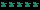
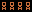

# System Setup Guide


This document outlines the hardware and software setup required to replicate a physical Atari learning environment:

- Hardware configuration (Atari console, monitor, lighting, camera, controller)
- Ubuntu system setup and driver management
- Calibration and validation tools
- Tips for minimizing latency, increasing consistency, and preventing regressions

For an overview of the project and high-level goals, refer to the [README](../README.md) in the root of this repository.

---

## Hardware Configuration

### Atari 2600+ Console

[Atari 2600+ with CX40+ Joystick](https://www.amazon.com/Atari-2600/dp/B0CG7LMFKY)

- Default video output is at 16:9 mode, but we recommend switching to **4:3 mode** (toggle switch on the back).
- This matches the original Atari aspect ratio and aligns better with simulation outputs.
- On a 16:9 monitor, this will introduce **pillarboxing** (black bars on the sides of the game image), which is expected.

---

### Monitor

**Requirements**:
- 60Hz refresh rate (matches Atari input framerate)
- Native resolution (disable scaling)
- sRGB or Standard mode for color accuracy
- Avoid dynamic contrast and auto-brightness

**Recommended Settings**:

| Setting      | Value                |
|--------------|----------------------|
| Brightness   | 100% (for consistency) |
| Contrast     | Medium               |
| Gamma        | 2.2 (sRGB)           |
| Overdrive    | On (avoid "Extreme") |
| Sharpness    | Neutral              |

---

### Lighting

Consistent ambient lighting is critical for reliable score detection.

**Preferred Setup**:
- Soft, diffused light with minimal shadows
- Avoid direct light on monitor
- Avoid strong backlighting

Hardware option: [Dual camera mount + light ring](https://www.amazon.com/dp/B0CLL9473V)

---

### USB Camera

**Recommended**: [Razer Kiyo Pro (1080p)](https://www.amazon.com/dp/B08T1MWX6J)
**Requirement**: 60FPS uncompressed video via USB 3.0

#### Connection Notes
- Use USB 3.0 cable (included or verified replacement)
- Connect to USB 3.0 port.

#### To Verify:
```bash
lsusb -v | grep bcdUSB        # look for 0x0300
dmesg | grep usb              # confirm 5000Mbps link
lsusb -t                      # check USB tree for speed
```

#### Camera Settings
Configure by script or interactive UVC tool:

| Parameter     | Value      |
|---------------|------------|
| Brightness    | Neutral    |
| Gain          | Low        |
| Contrast      | Mid-low    |
| Saturation    | Neutral    |
| Sharpness     | Off        |
| Adaptive FPS  | Disabled   |


> Run `tests/test_camera.py` to verify stable 60FPS.

---

### Camera Placement

- Mount camera directly in front of the monitor
- Ensure screen fills frame horizontally
- Ideal pixel sampling: **2 camera pixels per Atari pixel**
  (At 640×480 capture, that means ~420px coverage of a 480px Atari game height)

Secure the mount tightly to prevent drift or vibration.

---

### Output Controller

Two supported control options:

---

#### Mechanical Control (RoboTroller)

A robotic actuator that physically manipulates the CX40+ joystick.

For full documentation and build instructions, see [RoboTroller](https://robotroller.keenagi.com).

**Dynamixel Servo Setup**

1. Install [Dynamixel Wizard 2](https://emanual.robotis.com/docs/en/software/dynamixel/dynamixel_wizard2/)
2. Dynamixel servos all ship with the default ID of 0 and cannot be connected at the same time until their IDs are distinct. Connect them one at a time and scan for them. Set the id for each servo to correspond to its position
- 50 for the red joystick button
- 51 for left-right motion
- 52 for up-down motion
3. For each servo, set its baud rate to **2 Mbps**.
4. Connect all three servos simultaneously and scan using the Dynamixel Wizard 2. They should all show up connected with a 2 Mbps connection.
5. Send test commands to verify servo responsiveness.

---

#### Digital I/O Controller

Simulates digital input via USB I/O device.

**Recommended Device**: [MCC DAQ 1024LS](https://www.amazon.com/dp/B003DV6W9G)

 **Notes**

- Requires Windows + InstaCal to upgrade firmware
  [InstaCal Download](https://digilent.com/reference/software/instacal/start)
- Device uses USB 1.1 – some added latency is expected
- For full build instructions, see: [io_controller.md](./io_controller.md)

 **Test Wiring**

1. Wire the USB DAQ to a DB9 joystick cable (see wiring in [io_controller.md](./io_controller.md))
2. Load an Atari game like *Berzerk* which exercises all the actions in an obvious way.
3. Run: `tests/test_controller.py` to drive the Atari game with your keyboard.

---


## Ubuntu System Setup

Install Ubuntu **24.04 LTS**. Then:

```bash
sudo apt update && sudo apt dist-upgrade
sudo reboot
```

---

### Passwordless Sudo

**Not recommended for external or multi-user environments.**

Used for unattended execution and automation in trusted environments.
If you use this, restrict access to the machine and be aware of security implications.

```bash
echo 'your_username ALL=(ALL) NOPASSWD:ALL' | sudo tee /etc/sudoers.d/your_username
sudo chmod 0440 /etc/sudoers.d/your_username
```

---

### Lambda Stack

Managed CUDA, cuDNN, PyTorch, and GPU driver stack (convenient and reproducible):

```bash
wget -nv -O- https://lambdalabs.com/install-lambda-stack.sh | sh -
```

#### MOK Enrollment (Secure Boot Systems)

During install:
- You'll be prompted to create a MOK (Machine Owner Key) password
- Accept the cuDNN license
- After installation finishes, reboot
  - On reboot, your system will enter the MOK Manager
  - Choose "Enroll MOK", enter the password you created, and reboot again.

MOK is required to sign kernel modules (like NVIDIA drivers) on systems with Secure Boot enabled.

> If you do not enroll the MOK key, the NVIDIA driver will silently fail to load.


#### Pin NVIDIA and Lambda packages

To avoid mismatched updates and version drift from system updates, hold Lambda Stack packages after install:

```bash
./scripts/lambda-hold.sh
```

---

### Docker + NVIDIA Toolkit

Install from official instructions:

- [Docker for Ubuntu](https://docs.docker.com/engine/install/ubuntu/)
- [Post-install for non-root use](https://docs.docker.com/engine/install/linux-postinstall/)
- [NVIDIA Container Toolkit](https://docs.nvidia.com/datacenter/cloud-native/container-toolkit/latest/)


---

## System Performance Validation

Modern systems prioritize power efficiency by default, which can hurt performance consistency.
Factors like:
- CPU frequency scaling
- GPU power gating
- Disabled CPU cores
- OS "balanced" or "power saver" modes
can all introduce latency, jitter, or throttling.

---

### Performance Check

A diagnostic script (scripts/check_performance.py) is provided to validate and optionally fix system-level performance settings.

#### Ideal Conditions

Run the script **on AC power with a fully charged battery**.
> Running on battery or with thermal throttling may result in false warnings or degraded metrics.

---

#### Hardware Requirements

- **GPU**: NVIDIA discrete GPU (e.g., RTX 4090) with official NVIDIA driver
- **CPU**: Intel processor with RAPL (powercap) support
- **OS**: Ubuntu 24.04 LTS (or compatible)

#### What It Checks

| Subsystem       | Check                                                                 |
|-----------------|-----------------------------------------------------------------------|
| CPU Governor    | Ensures all CPUs are set to 'performance'                             |
| CPU Online      | Verifies all logical CPU cores are online                             |
| CPU Frequencies | Displays min, max, and current frequency per core                     |
| NVIDIA Driver   | Validates persistence mode, 'nvidia-powerd', P-State, throttling      |
| GPU Clocks      | Checks current vs max clocks and throttling status                    |
| GPU Power Limit | Confirms configured power limit matches hardware maximum              |
| Thermal Limits  | Warns if CPU or GPU thermal caps are unusually low                    |
| Power Profile   | Detects whether OS is in performance mode                             |
| PowerCap (RAPL) | Reports Intel RAPL domain limits and constraints                      |

---

#### Usage

After initial setup, run the script with root privileges (outside Docker):

```bash
sudo python3 scripts/check_performance.py
```

The script will summarize current performance settings and optionally apply fixes.

---

#### When to Re-Run

Re-run after any of the following:
- **NVIDIA GPU driver updates**
- **Linux kernel upgrades**
- **System updates affecting power/thermal behavior**
- **Firmware/BIOS changes or hardware modifications**

Keeping your system in a known high-performance state avoids obscure bugs during model training and benchmarking.

---

### X11 vs Wayland Notes

Newer versions of Ubuntu default to **Wayland**, which offers:

- Better security and input isolation
- Lower latency and direct GPU support (with NVIDIA 495+)

However, X11 remains more compatible with certain GUI-based tools and Docker setups.

#### X11 Container Support

```bash
docker run --rm -it --gpus all \
  -e DISPLAY=$DISPLAY \
  -v /tmp/.X11-unix:/tmp/.X11-unix \
  your_container
```

#### Wayland Setup (Experimental)

```bash
-e DISPLAY=$WAYLAND_DISPLAY
-v $XDG_RUNTIME_DIR/$WAYLAND_DISPLAY:$XDG_RUNTIME_DIR/$WAYLAND_DISPLAY
```

---

### Developer Tools

```bash
sudo apt install v4l-utils usbutils
```

Recommended installs:
- Chrome (TensorBoard, Jupyter)
- Visual Studio Code (Python, C++, Devcontainers)
---

## Score and Lives Box Placement

A GUI tool is provided to define the screen regions for score and lives detection. It allows you to interactively position bounding boxes over the score and lives regions.

These coordinates are saved and used to extract score/lives information from the image.

### How to Use

When running the main program, a GUI will automatically launch to assist with configuring the regions for score and lives detection.

The GUI allows you to visually inspect a captured frame and position bounding boxes over the score and lives areas. Once confirmed, these coordinates are saved for future runs.
- Use the keyboard to move the boxes.
- When done, the tool saves a config file (e.g. `.json`) with the region definitions.
- Ensure boxes align tightly around the digits or icons to maximize detection reliability.

### Reference Images

Use the following images as guidance for placing the score and lives boxes accurately.

| Game | Score Box | Lives Box|
| ---- | ---- | --- |
| Atlantis |  | |
Battle Zone |  |  |
| Centipede |   |  |
| Defender |   |  |
| Krull |  |  |
| Ms. Pac-Man |  |  |
| Q*bert |  |  |
|  Up'n Down |   |  |


> These examples show correct positioning for each game's layout. Misaligned boxes may result in unreliable detection.
---


## April Tags (Advanced)

April Tags are used to detect the corners of the active 4:3 screen region for camera alignment and score extraction.

Download tags from:
[AprilTags - tag36h11 Family](https://github.com/AprilRobotics/apriltag-imgs/tree/master)

### Tag Size and Preparation

Use the following script to convert and scale the tags to physical size:

```bash
python3 tag_to_svg.py tag36h11/tag36_11_00000.png tag36_11_00000.svg --size=50mm
```

- **Recommended size**: 50mm × 50mm — this works well for close-range camera viewing and dim or uneven lighting.
- Print the tags on **matte adhesive vinyl paper** for best results.
  - Avoid glossy finishes (can cause glare)
  - Matte surfaces provide better contrast for detection

> **Important**: Before applying the printed tags to your monitor, test the adhesive on a small, inconspicuous section to ensure it does not damage the screen surface or leave residue.

You may also print on standard paper and apply using **removable double-sided tape**, but this may result in misalignment or curling over time.

---

### Tag Placement

Place tags at the corners of the 4:3 content area as follows:

```
0 ------> 1
|         |
|         |
3 <------ 2
```

- Use a full-screen 4:3 game like *Pong* to align placement precisely.
- Ensure tags are flush with the top and bottom edges of the 4:3 content.
- No tag rotation: the orientation of each tag (ID and corner order) must remain intact for detection to succeed.

---

### Illumination Considerations

April Tag detection can be impacted by:

- Dim lighting (low contrast)
- Bright screen content (causes tag washout)
- Reflections on glossy tag surfaces

**Recommendations**:

- Use soft, diffuse side-lighting or a ring light around the camera. When using a ring light, use the dimmest setting to prevent glare.
- Increase tag size if operating under low-light conditions
- If available, print tags on **translucent film** and backlight them using a custom **3D-printed tag frame**

> A lighted camera mount with ring light can greatly improve detection:
> [Example - Camera Ring Mount](https://www.amazon.com/dp/B0CLL9473V)

---

## Resolving Runtime Errors

- **'torch.cuda.init()' failure** - Ensure 'nvidia-modprobe' is installed:
  ```bash
  sudo apt install nvidia-modprobe
  ```

- **USB camera limited to 30 FPS**
  If your USB 3.0 camera is limited to 30 FPS instead of 60 FPS:
  - Confirm the cable is USB 3.0 compliant and undamaged.
  - Ensure the camera is plugged into a USB 3.0 port.
  - Replace the cable if necessary. Low-quality or damaged cables can restrict bandwidth.

- **Laptop performance throttling (power-related)**
  - If the system runs at reduced frame rates while on battery or after being recently plugged in, performance may still be throttled due to power-saving states or thermal limits.
  - Symptoms can persist even after the battery is charging or full.
  - **Resolution**:
    - Ensure the laptop is in "Performance" mode in BIOS/firmware or power settings (`Settings -> Power -> Performance`).
    - Verify Dynamic Boost is enabled [See Performance](#system-performance-validation)
    - Wait for system to exit any intermediate low-power states (may take a few minutes).
    - If unresolved, perform a **cold restart with devices unplugged** to fully reset USB and power states.

- **Unexplained persistent performance degradation**
  - System runs at reduced frame rates even on full battery and external power.
  - **Resolution**:
    - Power off the system completely.
    - Unplug all USB and power devices.
    - Wait at least 30 seconds to allow for a hardware-level reset of transient state ("flea drain")
    - Reconnect and reboot.
    - This should clear residual states in controllers or USB systems.

- **Screen not detected**
  - In real-world testing, if the screen is not detected:
    - Verify tag orientation and order.
    - Minimize glare and ambient lighting.
    - Ensure the object is within expected detection bounds.

---
